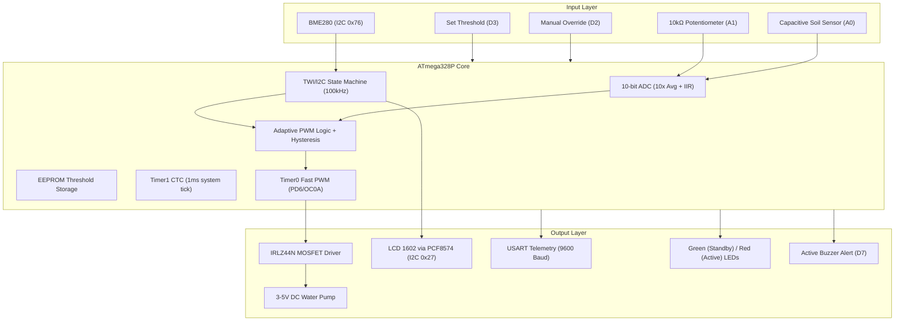
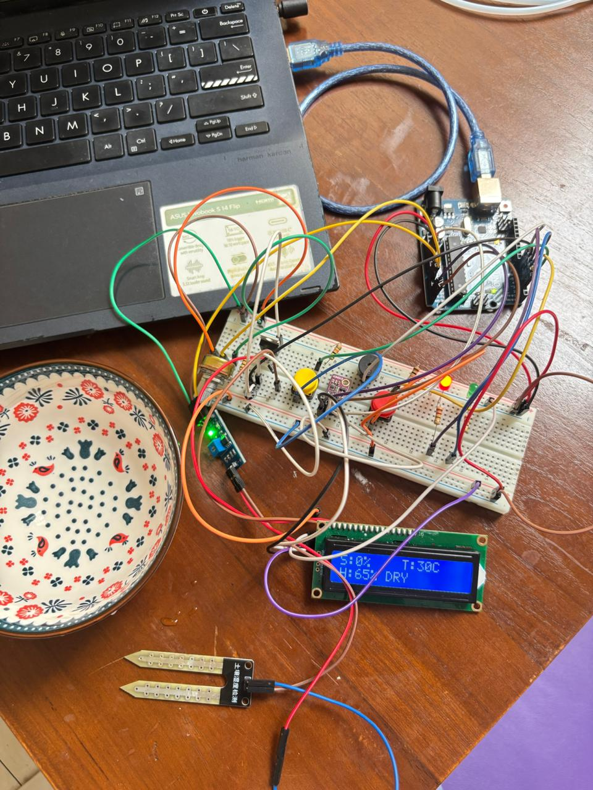
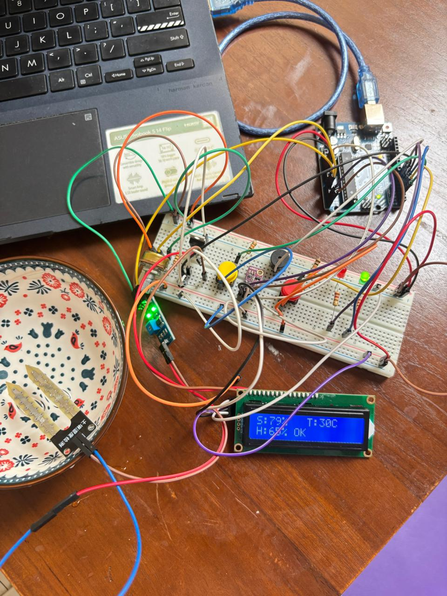

# Smart Plant System: Adaptive Soil Moisture Monitoring & Irrigation Control

[](https://www.ui.ac.id)
[](https://ee.ui.ac.id)
[-green.svg?style=flat-square)](https://digilab.ui.ac.id)
[-orange.svg?style=flat-square)](https://www.microchip.com/en-us/product/ATmega328P)
[-red.svg?style=flat-square)](https://gcc.gnu.org/onlinedocs/gcc/AVR-Options.html)
[](file:///c:/Github/smart-plant-system/LICENSE)

An advanced, bare-metal **Adaptive Soil Moisture Monitoring and Irrigation Control System** designed entirely in **AVR Assembly language (GAS syntax)** for the **ATmega328P (Arduino Uno)**. The system dynamically responds to ambient temperature/humidity (I2C BME280) and soil moisture (10-bit ADC capacitive sensing) to deliver proportional, PWM-modulated irrigation using an IRLZ44N MOSFET-switched DC water pump. 

Developed by **Group 21** as the final project for the Embedded Systems Practicum (MBD), Department of Electrical Engineering, **Universitas Indonesia**.

---

## Project Demonstration Video

[](https://youtu.be/IxW-3-iBPCM?si=JvgNWnSlYre8lw8v)

> **Watch the Live Demonstration:** [Smart Plant System Full Demonstration Video](https://youtu.be/IxW-3-iBPCM?si=JvgNWnSlYre8lw8v)

---

## Group 21 — Roles and Responsibilities

| Name | Student ID | Role | Primary Responsibilities |
| :--- | :---: | :---: | :--- |
| **Marshal Aufa D.** | 2406346913 | **Project Lead** | Overall project coordination, hardware-software integration, repository management. |
| **M. Rifqi Fadil Itsnain** | 2406355306 | **AVR Firmware Developer** | Bare-metal AVR Assembly code, ADC, Timer0/1, Fast PWM, and interrupt polling. |
| **Zahir** | 2406487084 | **Sensor & Comm Interface** | BME280 I2C sensor driver, LCD 1602 display, and USART serial telemetry. |
| **Arya Wibawa Atmanegara** | 2406420431 | **Simulation & Design** | Proteus Professional circuit simulation, schematic development, and driver validation. |
| **Syifa Naila Maulidya** | 2406436940 | **Documentation & Slides** | Technical report preparation, README documentation, and final presentation slide deck. |

---

## System Architecture

The system uses a bare-metal **Sense-Process-Actuate** architecture at 16 MHz with zero library dependencies:



---

## Hardware Pin Assignment & Register Configuration

### Pin Mapping
* **A0 (PC0):** Capacitive Soil Sensor Analog Input.
* **A1 (PC1):** 10kΩ Potentiometer input for threshold configuration.
* **A4/A5 (PC4/PC5):** I2C Shared Bus for BME280 (`0x76`) and LCD PCF8574 (`0x27`).
* **D2 (PD2) / D3 (PD3):** Active-LOW Buttons for Manual Override and Threshold Save.
* **D4 (PD4) / D5 (PD5):** Green LED (Normal status) / Red LED (Irrigation Active).
* **D6 (PD6):** MOSFET Gate switching line (Timer0 OC0A Fast PWM, `~977 Hz`).
* **D7 (PD7):** 5V Active Buzzer for critical moisture warning ($<20\%$).
* **3.3V / 5V:** BME280 Powered by **3.3V only** (VCC 3.6V max); other components powered by **5V**.

### Register Summary
* **ADMUX (`0x40`) / ADCSRA (`0x87`):** AVcc ref, right-adjusted, prescaler 128 (125 kHz ADC clock).
* **TCCR0A (`0x83`) / TCCR0B (`0x03`):** Timer0 Fast PWM, non-inverting output, prescaler 64 (`~977 Hz` on OC0A).
* **TCCR1A (`0x00`) / TCCR1B (`0x0B`) / OCR1A (`249`):** Timer1 CTC mode, prescaler 64, generating exactly a `1 ms` interrupt for non-blocking scheduling.
* **UCSR0B (`0x08`) / UBRR0 (`103`):** USART Tx-only, `9600 Baud` at 16 MHz.
* **TWBR (`72`) / TWSR (`0x00`):** I2C standard speed `100 kHz` at 16 MHz.

---

## Quick Assembly & Wiring Guide

1. **Power Rails:** Connect Arduino 5V and GND to the breadboard rails.
2. **Potentiometer:** Connect left/right pins to 5V/GND, center wiper pin to **A1**.
3. **Soil Sensor:** Connect VCC/GND to the 5V rail, and Analog Out to **A0**.
4. **BME280:** Connect SDA/SCL to **A4/A5**, GND to GND, and **VIN strictly to 3.3V**.
5. **Buttons:** Connect **D2** and **D3** to pushbuttons switching to GND (with 10kΩ external pull-ups to 5V).
6. **LEDs & Buzzer:** Connect Green/Red LEDs to **D4/D5** via 220Ω resistors. Connect Active Buzzer positive to **D7**.
7. **MOSFET & DC Pump:** 
   * Connect IRLZ44N **Source** to GND, **Gate** to **D6** via a 100Ω gate resistor, and **Drain** to the pump's negative wire.
   * Connect pump's positive wire to a **dedicated external power supply** (Powerbank) and share a **common ground** with the Arduino.
   * **EMI Filter:** Install a **1N4007 flyback diode** across the pump, and place a **100µF electrolytic** + **100nF ceramic capacitor** in parallel across pump power lines to suppress electrical noise.

---

### 🇮🇩 Panduan Perakitan Singkat (Bahasa Indonesia)
<details>
<summary><b>Klik untuk membuka Panduan Perakitan</b></summary>

1. **Power Rails:** Hubungkan 5V dan GND Arduino ke jalur panjang merah & biru breadboard.
2. **Potensiometer:** Kaki kiri/kanan ke 5V/GND, wiper tengah ke pin **A1**.
3. **Soil Sensor:** VCC/GND ke 5V rail, Analog Out ke **A0**.
4. **BME280:** SDA/SCL ke **A4/A5**, GND ke GND, **VIN wajib ke 3.3V**.
5. **Tombol:** Pin **D2** (Manual Override) & **D3** (Save Threshold) ke push-button hubung GND (beri pull-up eksternal 10kΩ ke 5V).
6. **LED & Buzzer:** LED Hijau/Merah ke **D4/D5** via resistor 220Ω. Positif buzzer aktif ke **D7**.
7. **MOSFET & Pompa:** 
   * IRLZ44N: Source ke GND, Gate ke **D6** via resistor 100Ω, Drain ke negatif pompa.
   * Positif pompa ke powerbank eksternal, kutub negatif powerbank wajib ke GND breadboard (common ground).
   * **Filter EMI:** Pasang dioda **1N4007** reverse-paralel di pompa, serta kapasitor **100µF** elektrolitik + **100nF** keramik paralel di kabel pompa.
</details>

---

## EMI Diagnosis & Mitigation (Crucial Hardware Lesson)
During testing, brushed DC pump commutator sparks generated severe **conducted electromagnetic interference (EMI)**. This noise contaminated `AVcc`, causing frozen ADC soil moisture readings and corrupted USART serial transmission.

**Resolution:**
1. **Isolated Power Rails:** Separated the motor supply (external powerbank) from the signal supply (Arduino).
2. **Single-Point Grounding:** Tied the external supply ground to the Arduino GND at a single isolated point to prevent ground loops.
3. **Snubber Network:** Clamped inductive flyback spikes using a **1N4007 diode** and filtered RF noise using **100µF + 100nF capacitors** directly across the pump terminals.

---

## Decision Logic & System Testing

### Decision State Table
| Soil Moisture | Temp | Humidity | Pump State | PWM Duty | LED Indicator | Buzzer | Output Status |
| :---: | :---: | :---: | :---: | :---: | :---: | :---: | :---: |
| **< 20%** | Any | Any | **ON** | `120` | Red | **ON (2 Hz)** | `CRITICAL DRY` |
| **20% – 34%** | > 30°C | < 40% | **ON** | `110` | Red | OFF | `DRY (BOOST)` |
| **20% – 34%** | ≤ 30°C | ≥ 40% | **ON** | `100` | Red | OFF | `DRY` |
| **35% – Threshold** | > 30°C | < 40% | **ON** | `90` | Red | OFF | `MILD (BOOST)` |
| **35% – Threshold** | ≤ 30°C | ≥ 40% | **ON** | `80` | Red | OFF | `MILD` |
| **> Threshold (OK)** | Any | Any | **OFF** | `0` | Green | OFF | `OK` |
| **> Threshold (Wet)** | Any | > 85% | **OFF** | `0` | Green + Red | OFF | `WET ALERT` |
| **Manual Override** | Any | Any | **ON** | `120` | Red | OFF | `MANUAL` |

*Note: Hysteresis band of 3% prevents pump cycling at boundaries. Safe default threshold is persisted in EEPROM (address `0x00`) with validity checking (10-90% range).*

### Testing Summary
The system was verified across **24 integration test scenarios** including sensor calibration, BME280 I2C scanning (detected at `0x76`), PCF8574 LCD backpack scanning (detected at `0x27`), EEPROM read/write robustness, debounced interrupts, and full EMI load testing. **All 24 test cases passed successfully.**

---

## System Documentation & Telemetry

| Dry Soil (Automatic Irrigation Active) | Adequate Soil (Pump Standby) |
| :---: | :---: |
|  |  |

### USART Telemetry Sample Block
Telemetry is transmitted at 9600 Baud every second:
```text
=================================
     SMART PLANT SYSTEM READY    
=================================
SOIL       : 18% (CRITICAL DRY)
TEMP       : 28.5 C
HUMIDITY   : 65%
THRESHOLD  : 40%
PWM POMPA  : 120
PUMP STATE : ON
MANUAL     : OFF
```

---

## Compilation & Upload Guide

1. Place **[source/main.S](file:///c:/Github/smart-plant-system/source/main.S)** inside a clean Arduino project directory named `source`.
2. Connect your Arduino Uno, open `source.ino` (or target `.S` file directly) in the **Arduino IDE (v2.x)**.
3. Select board **Arduino Uno** and the correct COM Port.
4. Click **Upload** to compile via `avr-gcc` and flash the microcontroller. Open **Serial Monitor** at **9600 baud** to view real-time logs.

---

## License & Acknowledgements

* **License:** Licensed under the **[MIT License](file:///c:/Github/smart-plant-system/LICENSE)**.
* **Acknowledgements:** Sincere gratitude to **Dr. Eng. Muhammad Salman, S.T., M.I.T.**, the Embedded Systems (MBD) teaching team, and the **Digital Laboratory (Digilab UI)** assistants.
